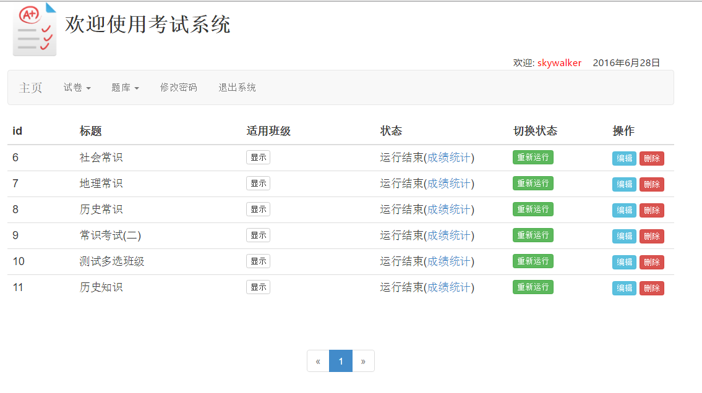
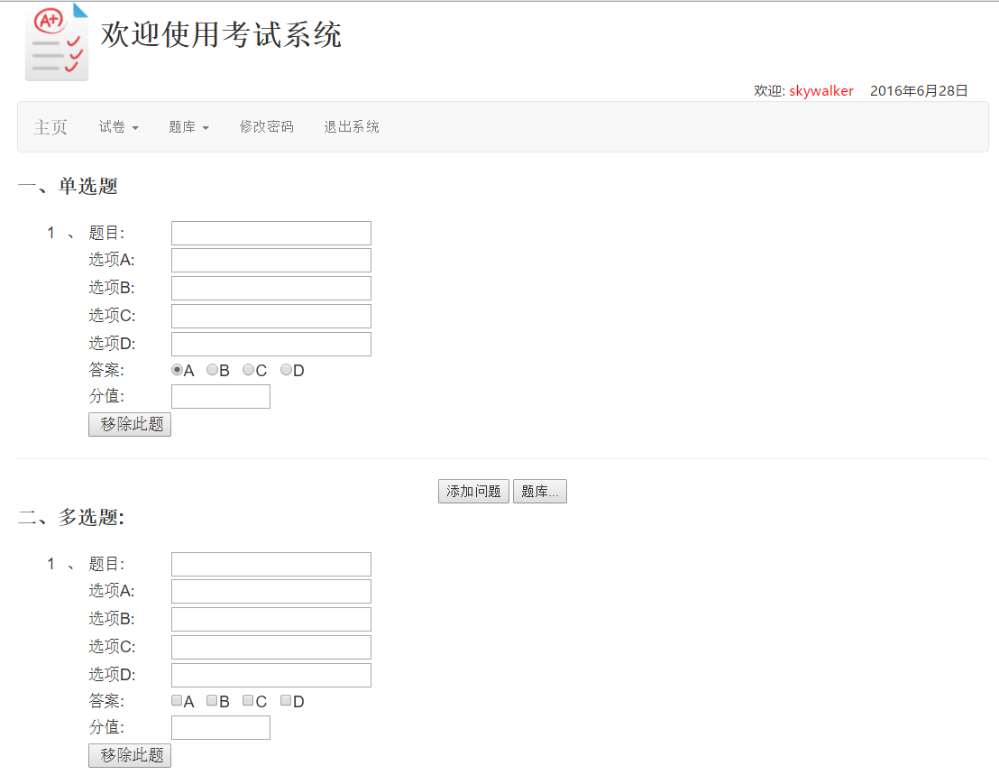

# 主要功能

管理员对年级、专业、班级进行管理，教师出题，根据已有的题或新出的题设计试卷，切换试卷的状态，使用jfreechart生成分数区间以及最高分最低分统计图，利用poi导出一套试卷的成绩单，查看某一道题的正答率，考生可以参加考试并且可以查看自己的考试记录(包括每道题回答正确与否以及答错的选项)

# 使用的框架

Spring、Spring jdbcTemplate、Spring MVC、jQuery

# 部分截图

## 试卷列表(教师)


## 出题界面


# 使用方法

首先安装好MySQL，然后使用命令导入数据库表:

```bash
mysql -u root -p123456 --default_character_set utf8 < onlineexam.sql
```

之后修改jdbc.properties即可。
